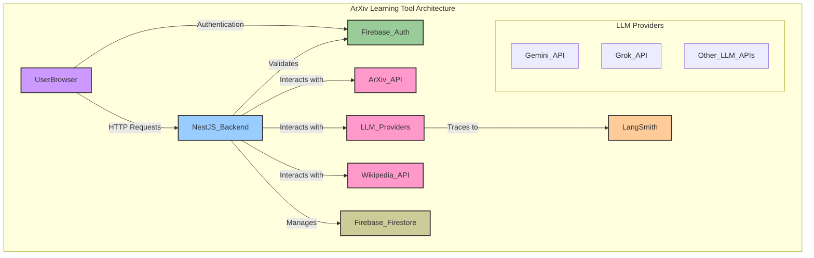

# Product Requirements Document: ArXiv Paper Learning Tool (NestJS Edition)

## 1. Overview

**Product Name**: ArXiv Paper Learning Tool

**Description**: An AI-powered learning assistant that helps users understand academic papers by identifying knowledge gaps, assessing current understanding, and creating personalized learning paths to reach the desired comprehension level. This document outlines the requirements for a NestJS-based implementation.

### 1.1 Motivation and Background

Academic papers often assume significant domain knowledge, creating barriers for researchers entering new fields, students, and interdisciplinary professionals. This tool bridges knowledge gaps by creating personalized learning paths from a user's current understanding to the level needed to comprehend specific papers.

### 1.2 Key Differentiators

- **Paper-centric approach**: Start with a specific paper rather than general topics.
- **Prerequisite mapping**: Automatically identifies concepts needed to understand the paper.
- **Self-Rated Assessment**: Users rate their own understanding of key concepts.
- **Dynamic syllabus generation**: Creates custom learning paths using paper references and Wikipedia.

### 1.3 Scope

**In Scope (MVP)**:

- ArXiv paper downloading and parsing.
- Concept extraction and prerequisite identification.
- Knowledge assessment (self-rated).
- Syllabus generation with references and Wikipedia content.
- Course saving and management.
- Progress tracking (lessons read).
- Multi-course support.
- User authentication with Firebase Auth.
- User-specific data persistence.

**Out of Scope (MVP)**:

- Papers from other sources (non-ArXiv).
- Interactive lessons/exercises.
- Mobile optimization.
- Detailed progress analytics.
- Social features (sharing, collaboration).

## 2. Goals and Objectives

### 2.1 Primary Goals

1. **Accessibility**: Make academic papers understandable regardless of background.
2. **Efficiency**: Minimize time from paper discovery to comprehension.
3. **Accuracy**: Correctly identify and teach prerequisite concepts.
4. **Simplicity**: A proof-of-concept showcasing core functionality without unnecessary complexity.

### 2.2 Success Criteria

- Successfully parse and analyze ArXiv papers.
- Accurately identify 80%+ of key concepts requiring background knowledge.
- Generate relevant, coherent learning paths.
- Complete user journey in < 10 minutes for an average paper.

## 3. Target Audience

- **Researchers**: Exploring papers outside their primary field.
- **Graduate Students**: Reading papers for coursework or research.
- **Technical Professionals**: Keeping up with academic developments.
- **Self-learners**: Motivated individuals exploring academic content.

## 4. User Journey

1. **Authentication**:
    - User signs in using Firebase Auth (Google, email/password, or other providers).
    - System creates or retrieves user profile and preferences.
2. **Paper Input**:
    - User provides an ArXiv link or paper ID.
    - System downloads and parses the PDF.
3. **Concept Extraction**:
    - The system analyzes the paper to identify key technical concepts using the configured LLM provider.
4. **Knowledge Assessment**:
    - The user is presented with a list of concepts and self-rates their familiarity with the concept:
      - 0: No knowledge of the concept.
      - 1: Basic understanding of the concept.
      - 2: Fair understanding of the concept without technical details.
      - 3: Detailed technical understanding of the concept.
5. **Gap Analysis**:
    - The system identifies knowledge gaps based on the user's self-assessment.
6. **Course Generation**:
    - A personalized course is created with a syllabus, modules, and lessons.
    - Course is saved to the user's Firebase Firestore collection.
7. **Learning Interface**:
    - The user can navigate the course, read lessons, and track their progress.
    - Progress is automatically saved to Firebase Firestore per user.

## 5. Key Features

### 5.1 MVP Features

1. **ArXiv Integration**: Direct paper download and parsing.
2. **Concept Identification**: Model-agnostic LLM-powered concept extraction.
3. **Self-Rated Assessment**: A simple interface for users to rate their knowledge.
4. **Course Generation**: Creates structured courses from syllabi.
5. **Course Management**: Course listing and persistence with user-specific data.
6. **Progress Tracking**: Automatic lesson completion tracking per user.
7. **User Authentication**: Firebase Auth integration for secure user sessions.
8. **Multi-Provider LLM Support**: Flexible integration supporting Gemini, Grok, and other providers.

## 6. Technical Implementation Details

- **Backend**: NestJS
- **Database**: Firebase Firestore (NoSQL document database)
- **Authentication**: Firebase Authentication
- **Frontend**: Server-rendered HTML with DaisyUI styling
- **LLM Integration**: Model-agnostic service supporting multiple providers (Gemini, Grok, etc.)
- **Document Processing**: Multi-model support with fallback capabilities
- **Observability**: LangSmith integration for LLM call tracing

## 7. Technical Architecture (High-Level)



### 7.1 Database Schema (Firebase Firestore)

```typescript
// Firestore Collections and Document Structure

// Collection: users
interface User {
  uid: string;              // Firebase Auth UID
  email: string;
  displayName?: string;
  createdAt: Date;
  lastLoginAt: Date;
}

// Collection: courses
interface Course {
  id: string;               // Auto-generated document ID
  userId: string;           // Reference to user who created the course
  paperArxivId: string;
  paperTitle: string;
  comprehensionLevel: string;
  createdAt: Date;
  updatedAt: Date;
  modules: Module[];        // Embedded subcollection or array
}

// Subcollection: courses/{courseId}/modules
interface Module {
  id: string;
  title: string;
  orderIndex: number;
  lessons: Lesson[];        // Embedded array or subcollection
}

// Subcollection: courses/{courseId}/modules/{moduleId}/lessons
interface Lesson {
  id: string;
  title: string;
  content: string;
  orderIndex: number;
  createdAt: Date;
}

// Collection: progress
interface Progress {
  id: string;
  userId: string;           // Reference to user
  courseId: string;         // Reference to course
  lessonId: string;         // Reference to lesson
  moduleId: string;         // Reference to module
  readAt: Date;
  completedAt?: Date;
}

// Collection: userPreferences
interface UserPreferences {
  userId: string;
  defaultLLMProvider?: string;
  theme?: 'light' | 'dark';
  notifications?: boolean;
}
```

## 8. Development Phases

### Phase 1: Core Infrastructure (Week 1)

- NestJS project setup.
- Firebase Auth integration.
- Firebase Firestore setup.
- ArXiv integration.
- PDF parsing.
- Basic UI setup.

### Phase 2: Intelligence Layer (Week 2)

- Model-agnostic LLM service implementation.
- LangSmith tracing integration.
- Concept extraction with multiple LLM providers.
- Self-rated assessment logic.
- Gap analysis.

### Phase 3: Content & Polish (Week 3)

- Wikipedia integration.
- Reference parsing.
- Syllabus generation.
- User-specific course management.
- Progress tracking implementation.
- UI refinement.

### Phase 4: Testing & Demo Prep (Week 4)

- End-to-end testing with Firebase.
- Performance optimization.
- Authentication flow testing.
- Documentation.
