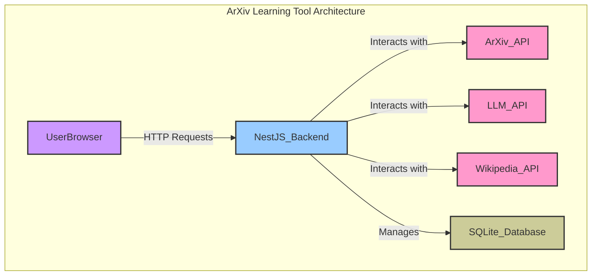

# Product Requirements Document: ArXiv Paper Learning Tool (NestJS Edition)

## 1. Overview

**Product Name**: ArXiv Paper Learning Tool

**Description**: An AI-powered learning assistant that helps users understand academic papers by identifying knowledge gaps, assessing current understanding, and creating personalized learning paths to reach the desired comprehension level. This document outlines the requirements for a NestJS-based implementation.

### 1.1 Motivation and Background

Academic papers often assume significant domain knowledge, creating barriers for researchers entering new fields, students, and interdisciplinary professionals. This tool bridges knowledge gaps by creating personalized learning paths from a user's current understanding to the level needed to comprehend specific papers.

### 1.2 Key Differentiators

- **Paper-centric approach**: Start with a specific paper rather than general topics.
- **Prerequisite mapping**: Automatically identifies concepts needed to understand the paper.
- **Self-Rated Assessment**: Users rate their own understanding of key concepts.
- **Dynamic syllabus generation**: Creates custom learning paths using paper references and Wikipedia.

### 1.3 Scope

**In Scope (MVP)**:

- ArXiv paper downloading and parsing.
- Concept extraction and prerequisite identification.
- Knowledge assessment (self-rated).
- Syllabus generation with references and Wikipedia content.
- Course saving and management.
- Progress tracking (lessons read).
- Multi-course support.

**Out of Scope (MVP)**:

- Papers from other sources (non-ArXiv).
- Interactive lessons/exercises.
- Full user authentication (email/password).
- Mobile optimization.
- Detailed progress analytics.

## 2. Goals and Objectives

### 2.1 Primary Goals

1. **Accessibility**: Make academic papers understandable regardless of background.
2. **Efficiency**: Minimize time from paper discovery to comprehension.
3. **Accuracy**: Correctly identify and teach prerequisite concepts.
4. **Simplicity**: A proof-of-concept showcasing core functionality without unnecessary complexity.

### 2.2 Success Criteria

- Successfully parse and analyze ArXiv papers.
- Accurately identify 80%+ of key concepts requiring background knowledge.
- Generate relevant, coherent learning paths.
- Complete user journey in < 10 minutes for an average paper.

## 3. Target Audience

- **Researchers**: Exploring papers outside their primary field.
- **Graduate Students**: Reading papers for coursework or research.
- **Technical Professionals**: Keeping up with academic developments.
- **Self-learners**: Motivated individuals exploring academic content.

## 4. User Journey

1. **Paper Input**:
    - User provides an ArXiv link or paper ID.
    - System downloads and parses the PDF.
2. **Concept Extraction**:
    - The system analyzes the paper to identify key technical concepts.
3. **Knowledge Assessment**:
    - The user is presented with a list of concepts and self-rates their familiarity with the concept:
      - 0: No knowledge of the concept.
      - 1: Basic understanding of the concept.
      - 2: Fair understanding of the concept without technical details.
      - 3: Detailed technical understanding of the concept.
4. **Gap Analysis**:
    - The system identifies knowledge gaps based on the user's self-assessment.
5. **Course Generation**:
    - A personalized course is created with a syllabus, modules, and lessons.
6. **Learning Interface**:
    - The user can navigate the course, read lessons, and track their progress.

## 5. Key Features

### 5.1 MVP Features

1. **ArXiv Integration**: Direct paper download and parsing.
2. **Concept Identification**: LLM-powered concept extraction.
3. **Self-Rated Assessment**: A simple interface for users to rate their knowledge.
4. **Course Generation**: Creates structured courses from syllabi.
5. **Course Management**: Course listing and persistence.
6. **Progress Tracking**: Automatic lesson completion tracking.

## 6. Technical Implementation Details

- **Backend**: NestJS
- **Database**: SQLite with TypeORM
- **Frontend**: Server-rendered HTML with DaisyUI styling.
- **LLM Integration**: Direct API calls to a gemini.
- **Document Processing**: Via gemini-2.0-flash.

## 7. Technical Architecture (High-Level)



### 7.1 Database Schema (SQLite with TypeORM)

```typescript
import { Entity, PrimaryGeneratedColumn, Column, CreateDateColumn, ManyToOne, OneToMany } from 'typeorm';

@Entity()
export class Course {
  @PrimaryGeneratedColumn()
  id: number;

  @Column()
  paperArxivId: string;

  @Column()
  paperTitle: string;

  @Column()
  comprehensionLevel: string;

  @CreateDateColumn()
  createdAt: Date;

  @OneToMany(() => Module, module => module.course)
  modules: Module[];
}

@Entity()
export class Module {
  @PrimaryGeneratedColumn()
  id: number;

  @Column()
  title: string;

  @Column()
  orderIndex: number;

  @ManyToOne(() => Course, course => course.modules)
  course: Course;

  @OneToMany(() => Lesson, lesson => lesson.module)
  lessons: Lesson[];
}

@Entity()
export class Lesson {
  @PrimaryGeneratedColumn()
  id: number;

  @Column()
  title: string;

  @Column('text')
  content: string;

  @Column()
  orderIndex: number;

  @ManyToOne(() => Module, module => module.lessons)
  module: Module;

  @OneToMany(() => Progress, progress => progress.lesson)
  progress: Progress[];
}

@Entity()
export class Progress {
  @PrimaryGeneratedColumn()
  id: number;

  @Column()
  lessonId: number;

  @CreateDateColumn()
  readAt: Date;

  @ManyToOne(() => Lesson, lesson => lesson.progress)
  lesson: Lesson;
}
```

## 8. Development Phases

### Phase 1: Core Infrastructure (Week 1)

- NestJS project setup.
- ArXiv integration.
- PDF parsing.
- Basic UI setup.

### Phase 2: Intelligence Layer (Week 2)

- Concept extraction with an LLM.
- Self-rated assessment logic.
- Gap analysis.

### Phase 3: Content & Polish (Week 3)

- Wikipedia integration.
- Reference parsing.
- Syllabus generation.
- UI refinement.

### Phase 4: Testing & Demo Prep (Week 4)

- End-to-end testing.
- Performance optimization.
- Documentation.
