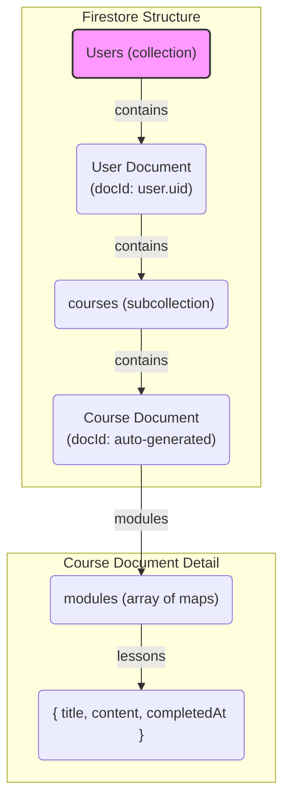

# Final Migration Plan: TypeORM & SQLite to Firestore

This plan outlines the steps to migrate the application's backend from TypeORM/SQLite to a user-centric Firestore data model.

## 1. Project Setup and Configuration

* **Install Firestore:** Add the Firestore client library to the project.

    ```bash
    npm install @google-cloud/firestore
    ```

* **Firestore Credentials:** Download your Firebase service account key.
* **Environment Variables:** Add the path to your credentials in your `.env` and `.env.example` files.

    ```
    GOOGLE_APPLICATION_CREDENTIALS=path/to/your/serviceAccountKey.json
    ```

## 2. Final Firestore Data Model

This model stores all course data within a subcollection of the user who owns it.



## 3. Code Implementation Steps

1. **Create a Firestore Module:**
    * Create a `firestore.module.ts` and `firestore.service.ts`.
    * The service will initialize the Firestore client and be provided globally.

2. **Remove TypeORM:**
    * Uninstall TypeORM and SQLite: `npm uninstall typeorm sqlite3 @nestjs/typeorm`
    * Delete the `src/database/entities` directory.
    * Remove all `TypeOrmModule` imports from your NestJS modules.

3. **Update Services and Controllers:**
    * Refactor all services and controllers to use the new `FirestoreService` instead of TypeORM repositories.
    * All database operations will now be scoped to a user, e.g., `firestore.collection('Users').doc(userId).collection('courses')`.

4. **Create TypeScript Interfaces:**
    * Define interfaces for `User`, `Course`, `Module`, and `Lesson` to match the new Firestore structure.

## 4. Testing

* **Unit Tests:** Mock the `FirestoreService` and its methods in your `*.spec.ts` files.
* **E2E Tests:** Use the official Firestore emulator to run tests against a local, ephemeral Firestore instance.
