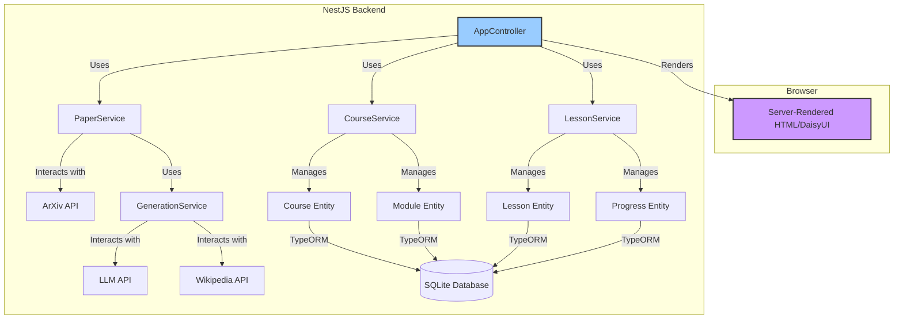

# ArXiv Learning Tool: Implementation Plan

## High-Level Plan & Architecture

The application will be built using a modular architecture in NestJS. Each core feature (paper handling, course generation, UI) will be encapsulated in its own module. Data will flow from the user's paper submission through to concept extraction, assessment, and finally to the generation of a persistent, learnable course.

Here is a proposed component diagram illustrating the internal structure:

---

### Phase 1: Core Infrastructure & Paper Ingestion

**Goal:** Establish the foundational project structure, connect the database, and implement the initial user step: submitting an ArXiv paper ID to be downloaded and stored.

**Tasks:**

1. **Project Setup:**
    * Initialize the NestJS project with the CLI (this appears to be done).
    * Install necessary dependencies: `typeorm`, `@nestjs/typeorm`, `sqlite3`, `axios` (for API calls).
2. **Database & Entities:**
    * Configure `AppModule` to connect to a SQLite database using TypeORM.
    * Create the TypeORM entities as defined in the PRD: `Course`, `Module`, `Lesson`, and `Progress`.
    * Enable `synchronize: true` in the TypeORM config for development to auto-generate the schema.
3. **ArXiv Integration:**
    * Create an `ArxivModule`.
    * Inside, create an `ArxivService` responsible for fetching paper details and the PDF from the ArXiv API.
4. **Initial UI & Workflow:**
    * Create a `PaperModule` with a `PaperController`.
    * The controller will have a root route (`GET /`) that renders a simple HTML page with a form asking for an ArXiv paper ID.
    * Create a second route (`POST /papers`) to handle the form submission. This endpoint will use the `ArxivService` to fetch the paper, create a preliminary `Course` entity, and save it.

**Testable & Demonstrable Outcome:** A user can load the homepage, enter an ArXiv ID, and upon submission, a `Course` record is created in the database.

---

### Phase 2: Concept Extraction & Knowledge Assessment

**Goal:** Analyze the downloaded paper using an LLM to identify key concepts and present them to the user for self-assessment.

**Tasks:**

1. **LLM Integration:** Create a `GenerationService` to handle calls to the Gemini API for concept extraction.
2. **Concept Extraction Workflow:** The `PaperController` will use the `GenerationService` to extract concepts and pass them to the assessment page.
3. **Assessment UI:** Create a route (`GET /courses/:id/assess`) that renders a form listing each concept with a 1-5 rating scale.

**Testable & Demonstrable Outcome:** After submitting a paper ID, the user is presented with a list of concepts and can rate their knowledge for each.

---

### Phase 3: Personalized Course Generation

**Goal:** Based on the user's self-assessment, generate a structured, personalized course with modules and lessons.

**Tasks:**

1. **Course Generation Logic:** Create a `CourseService` to identify knowledge gaps from the assessment and generate corresponding `Module` and `Lesson` entities. Lesson content will be generated via the `GenerationService`.
2. **Course Display UI:** Create routes to display the full course syllabus (`/courses/:id`) and individual lesson content (`/lessons/:id`).

**Testable & Demonstrable Outcome:** After submitting the assessment, the user sees a generated syllabus with modules and lessons.

---

### Phase 4: Course Management & Progress Tracking

**Goal:** Persist courses, allow users to view all their courses, and track completed lessons.

**Tasks:**

1. **Course Dashboard:** Modify the homepage to list all existing courses from the database.
2. **Progress Tracking Logic:** Implement a `POST /lessons/:id/complete` endpoint to create a `Progress` record when a user marks a lesson as read.
3. **UI Refinement:** Visually distinguish completed lessons on the syllabus page.

**Testable & Demonstrable Outcome:** The user can manage multiple courses and their progress is visually tracked and saved.
