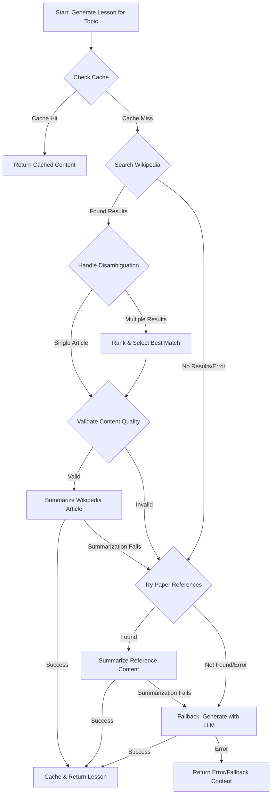

# Design Proposal: Content Generation from External Sources

## 1. Overview

This document outlines the design for enhancing the `GenerationService` to generate lesson content by sourcing information from Wikipedia and academic paper references, as specified in section 1.2 of the project's PRD. The primary goal is to create more accurate and verifiable lesson content, with a secondary goal of reducing reliance on expensive, general-purpose LLM generation.

The strategy is to prioritize sources in the following order:
1.  **Wikipedia**: Fast, cheap, and provides broad coverage.
2.  **Paper References**: Slower and more expensive, but offers highly relevant, in-depth content.
3.  **LLM-based Generation**: A fallback to ensure content is always generated.

## 2. Proposed Changes to `GenerationService`

A new public method, `generateLessonFromExternalSources`, will be introduced to orchestrate the content generation process. The existing `generateLessonContent` will be repurposed as a fallback mechanism.

### 2.1. New Methods

The following private methods will be added to `generation.service.ts`:

-   `searchWikipedia(query: string): Promise<WikipediaSearchResult | null>`: Takes a search query (e.g., a lesson topic), searches Wikipedia with caching and disambiguation handling, and returns the most relevant article data or `null` if no suitable article is found.
-   `validateWikipediaContent(content: string, topic: string): Promise<boolean>`: Uses an LLM to validate that Wikipedia content is relevant and suitable for the given topic before proceeding with summarization.
-   `summarizeWikipediaArticle(articleContent: string, topic: string, concept: string): Promise<{ title: string; content: string }>`: Uses an LLM to summarize the provided Wikipedia article content into a lesson, using a prompt similar to the existing `generateFocusedLessonPrompt`.
-   `getCachedWikipediaContent(cacheKey: string): WikipediaSearchResult | null`: Retrieves cached Wikipedia content if available and not expired.
-   `setCachedWikipediaContent(cacheKey: string, content: WikipediaSearchResult): void`: Stores Wikipedia content in cache with expiration.
-   `searchPaperReferences(topic: string, references: string[]): Promise<string | null>`: (Future implementation) This method will search through the text of referenced papers for relevant information.
-   `summarizePaperContent(paperContent: string, topic: string): Promise<{ title: string; content: string }>`: (Future implementation) This will summarize content from a reference paper into a lesson.

### 2.2. High-Level Workflow

The new workflow for generating a lesson for a given `topic` within a `concept` will be as follows:



## 3. Wikipedia Integration Details

To interact with the Wikipedia API, we will use the built-in `fetch` API. The MediaWiki Action API provides a straightforward way to search for and retrieve page content.

### 3.1. API Endpoints and Actions

-   **Endpoint**: `https://en.wikipedia.org/w/api.php`
-   **Actions**:
    1.  `action=query`, `list=search`, `srsearch=<topic>`, `srlimit=5` to find up to 5 relevant pages.
    2.  `action=query`, `prop=extracts|info`, `titles=<page_title>`, `exintro=false`, `explaintext=true`, `inprop=url` to get the full content and metadata.

### 3.2. Caching Strategy

Wikipedia content will be cached in-memory to avoid repeated API calls:

```typescript
interface WikipediaSearchResult {
  title: string;
  content: string;
  url: string;
  timestamp: number;
  relevanceScore?: number;
}

interface WikipediaCache {
  [key: string]: {
    data: WikipediaSearchResult;
    expiry: number;
  };
}
```

**Cache Configuration**:
- **TTL (Time To Live)**: 24 hours for Wikipedia content (academic concepts change infrequently)
- **Cache Key Format**: `wikipedia:${sanitized_topic}`
- **Max Cache Size**: 100 entries (LRU eviction when exceeded)
- **Storage**: In-memory cache (reset on service restart)

### 3.3. Disambiguation Handling

When Wikipedia returns multiple results, the system will:

1. **Automatic Ranking**: Score results based on:
   - Title similarity to the search query (Levenshtein distance)
   - Presence of key terms from the broader `concept` context
   - Article length (longer articles often indicate more comprehensive coverage)
   - Whether the article is a disambiguation page (deprioritize these)

2. **Selection Logic**:
   - If the top result has a relevance score > 0.8, select it automatically
   - If multiple results have similar scores (< 0.2 difference), prefer the one with more content
   - Skip disambiguation pages unless they're the only result

3. **Fallback**: If no article meets quality thresholds, proceed to paper references or LLM generation

### 3.4. Content Quality Validation

Before summarizing Wikipedia content, the system will validate its relevance:

**LLM Validation Prompt**:
```
Evaluate whether the following Wikipedia article content is relevant and suitable for creating a lesson about the topic: "{topic}" within the broader concept of "{concept}".

Consider:
- Does the content directly address the topic?
- Is the content at an appropriate technical level for academic learning?
- Does the content contain sufficient detail for a 2-3 minute lesson?
- Is the content factual and educational (not opinion-based)?

Article Content: {first_500_words}

Respond with only "RELEVANT" or "NOT_RELEVANT" followed by a brief reason.
```

**Quality Thresholds**:
- Minimum content length: 200 words
- Must not be a stub article
- Must not be primarily a list or disambiguation page
- Content must pass LLM relevance validation

## 4. Prompt Engineering for Summarization

The quality of this feature hinges on the summarization prompt. The prompt for summarizing Wikipedia content will instruct the LLM to:

-   Create a lesson of a specific length (2-3 minutes reading time).
-   Focus on the provided `topic`, using the `concept` for context.
-   Maintain a neutral, educational tone.
-   Format the output in Markdown, consistent with existing lessons.
-   Include a "Source: Wikipedia" attribution at the end of the lesson.

## 5. Future Implementation: Paper References

The logic for paper references will be more complex and is planned for a later phase. It will require:
1.  A mechanism to extract and store references from the source ArXiv paper. This should happen in the `PaperService` when the paper is first processed.
2.  A way to fetch the content of these referenced papers (e.g., via the ArXiv API or other academic search APIs).
3.  A robust text-chunking and embedding-based search strategy to find relevant passages within the reference papers.

Placeholders for this functionality will be included in the initial implementation.

## 6. Error Handling & Fallbacks

Robust error handling is critical for production reliability:

### 6.1. Wikipedia API Failures
- **Network Errors**: Retry up to 3 times with exponential backoff (1s, 2s, 4s)
- **Rate Limiting**: Respect Wikipedia's rate limits (10 requests/second max)
- **Invalid Responses**: Log error details and proceed to next fallback
- **Timeout**: Set 30-second timeout for Wikipedia API calls

### 6.2. Content Quality Failures
- **Validation Rejection**: If LLM validation fails, try the next search result
- **Insufficient Content**: If article is too short, try alternative search terms
- **Disambiguation Loops**: If all results are disambiguation pages, proceed to paper references

### 6.3. Cache Management
- **Cache Corruption**: If cached data is malformed, invalidate and refetch
- **Memory Pressure**: Implement LRU eviction when cache exceeds 100 entries
- **Stale Data**: Automatic expiry after 24 hours

### 6.4. Fallback Chain
1. **Wikipedia Search** → Content Validation → Summarization
2. **Paper References** (future implementation)
3. **LLM Generation** (existing fallback)
4. **Static Fallback Content** (ultimate safety net)

Each step includes comprehensive logging for debugging and monitoring.